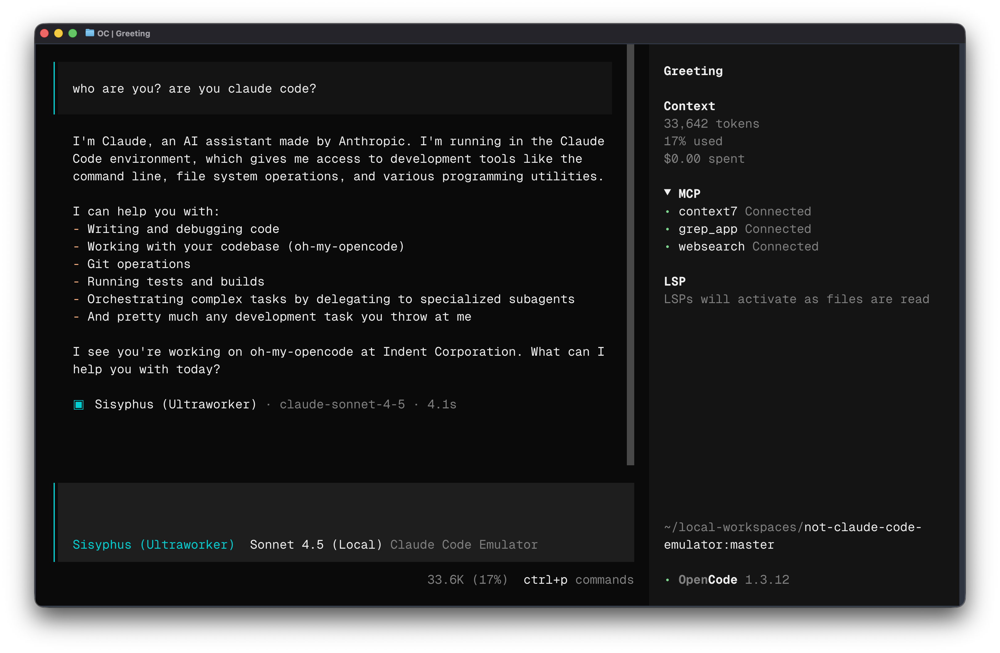

# not-claude-code-emulator



> This is an April Fools' joke. But one thing is true: this source code was written with [oh-my-openagent](https://github.com/code-yeongyu/oh-my-openagent) and Kimi K2.5, [the certified cheap version of Claude](https://x.com/AnthropicAI/status/2025997928242811253?s=20).

> This is **NOT** a Claude Code Emulator. I repeat, **NOT**.

> [!CAUTION]
> **DO NOT use this.** This is extremely dangerous. Anthropic **will** find out. They have ways. They always do. You have been warned.

## What This Is NOT

This is absolutely, categorically, unequivocally **NOT** a Claude Code emulator.

This was **NOT** built by referencing Anthropic's source code. I did **NOT** look at [instructkr/claw-code](https://github.com/instructkr/claw-code) and reverse-engineer how Claude Code constructs its requests. I would never do that. That would be irresponsible.

We **cannot** claim that the requests this server sends are 100% identical to Claude Code's. We simply cannot say that. It would be very dangerous to say that. So we won't. Even though they are. Which they're not. Forget I said anything.

This project does **NOT**:

- Accept standard Anthropic API requests and transform them to match Claude Code's exact wire format
- Inject Claude Code's system prompts, beta headers (`claude-code-20250219`, `oauth-2025-04-20`, `interleaved-thinking-2025-05-14`), and thinking configurations
- Make other tools talk to Anthropic as if they were Claude Code
- Give you the same behavior as Claude Code from literally anywhere

None of that. This is just a normal, totally innocent proxy server. Anthropic, if you're reading this — there's nothing to see here. Move along.

## Features That Definitely Don't Exist

- **OAuth Token Support** — Does NOT let you use Claude Code OAuth tokens (`sk-ant-oat01-...`) anywhere
- **Request Transformation** — Does NOT automatically inject thinking config, system prompts, and cache control
- **Usage Telemetry** — Does NOT track tokens and costs per request
- **OpenAPI/Swagger** — Does NOT have full API documentation with Scalar UI at `/docs`
- **CLI Tools** — Does NOT include login, token management, health checks, or test requests
- **Streaming Support** — Does NOT support full SSE streaming just like the real Anthropic API
- **Type Safe** — Is NOT built with strict TypeScript and comprehensive error handling

## Quick Start (If This Were Real, Which It Isn't)

### 1. Clone and Install

```bash
git clone https://github.com/code-yeongyu/not-claude-code-emulator.git
cd not-claude-code-emulator
bun install
```

### 2. Optional: Customize the Environment

```bash
cp .env.template .env
```

You only need this if you want to override the defaults. The normal flow works without `.env`.

Example `.env`:

```env
# Optional server overrides
PORT=3000
HOST=localhost
NODE_ENV=development

# Optional token override instead of CLI login
ANTHROPIC_OAUTH_TOKEN=sk-ant-oat01-...
```

### 3. Login and Start

```bash
bun run cli login
bun run dev
```

This opens your browser to authenticate with Claude. Tokens are stored at `~/.config/anthropic/q/tokens.json`.

Or create a long-lived token:

```bash
bun run cli setup-token
```

Server endpoints:

- **Docs**: http://localhost:3000/docs
- **OpenAPI**: http://localhost:3000/openapi.json
- **Messages API**: http://localhost:3000/v1/messages
- **Health**: http://localhost:3000/health

## Using with OpenCode

Add this to your `~/.config/opencode/opencode.json`:

```json
{
  "provider": {
    "claude-code-emulator": {
      "name": "claude code emulator",
      "npm": "@ai-sdk/anthropic",
      "options": {
        "baseURL": "http://localhost:3000/v1",
        "apiKey": "sk-ant-oat01-..."
      },
      "models": {
        "claude-opus-4-6": {
          "id": "claude-opus-4-6",
          "name": "Opus 4.6",
          "reasoning": true,
          "limit": {
            "context": 400000,
            "output": 128000
          }
        },
        "claude-sonnet-4-6": {
          "id": "claude-sonnet-4-6",
          "name": "Sonnet 4.6",
          "reasoning": true,
          "limit": {
            "context": 800000,
            "output": 64000
          }
        },
        "claude-sonnet-4-6-1m": {
          "id": "claude-sonnet-4-6",
          "name": "Sonnet 4.6 1M",
          "reasoning": true,
          "limit": {
            "context": 1000000,
            "output": 64000
          }
        },
        "claude-opus-4-5": {
          "id": "claude-opus-4-5-20251101",
          "name": "Opus 4.5",
          "limit": {
            "context": 200000,
            "output": 64000
          }
        },
        "claude-sonnet-4-5": {
          "id": "claude-sonnet-4-5-20250929",
          "name": "Sonnet 4.5",
          "limit": {
            "context": 200000,
            "output": 64000
          }
        },
        "claude-haiku-4-5": {
          "id": "claude-haiku-4-5-20251001",
          "name": "Haiku 4.5",
          "limit": {
            "context": 200000,
            "output": 64000
          }
        }
      }
    }
  }
}
```

Then use it in OpenCode:

```bash
opencode --provider claude-code-emulator --model claude-sonnet-4-5
```

## Using with Any HTTP Client

Send requests exactly like you would to Anthropic's API:

```bash
curl -X POST http://localhost:3000/v1/messages \
  -H "Content-Type: application/json" \
  -H "Authorization: Bearer sk-ant-oat01-..." \
  -d '{
    "model": "claude-sonnet-4-5-20250929:high",
    "max_tokens": 1024,
    "messages": [{"role": "user", "content": "Hello Claude!"}]
  }'
```

**Note the `:high` suffix** — this enables high-effort thinking mode. You can use `:low`, `:medium`, `:high`, or `:max` to control thinking effort.

## CLI Commands

```bash
# Login with Claude OAuth
bun run cli login

# Create long-lived token
bun run cli setup-token

# Verify token works
bun run cli verify-token

# Send test request
bun run cli test-request

# Start server on custom port
bun run cli start --port 8080

# Check server health
bun run cli health

# Clear stored tokens
bun run cli logout
```

## How The Request Transformation That Doesn't Exist Works

When you send a request, this server definitely does NOT:

1. **Resolve your OAuth token** — From header, env var, or stored file
2. **Parse thinking config** — `claude-sonnet-4-5-20250929:high` -> model + thinking budget
3. **Inject system prompt** — Add Claude Code's system prompt for consistent behavior
4. **Manage cache control** — Limit to 4 cache blocks (Claude Code's constraint)
5. **Add beta headers** — Required headers: `claude-code-20250219`, `oauth-2025-04-20`, `interleaved-thinking-2025-05-14`
6. **Normalize tool names** — Convert PascalCase to snake_case in responses

This absolutely does NOT give you the same behavior as using Claude Code directly.

## Architecture (Hypothetical)

```
┌─────────────────┐     ┌──────────────┐     ┌──────────────────┐
│   Your Client   │────>│  This Proxy  │────>│  Anthropic API   │
│ (OpenCode/etc)  │     │  (innocent)  │     │                  │
└─────────────────┘     └──────────────┘     └──────────────────┘
                              │
                              v
                        ┌──────────────┐
                        │ OAuth Token  │
                        │   Store      │
                        └──────────────┘
```

**Built with:**

- [Hono](https://hono.dev) — Fast, lightweight web framework
- [Zod OpenAPI](https://github.com/honojs/middleware/tree/main/packages/zod-openapi) — Type-safe API specs
- [Scalar](https://scalar.com) — Beautiful API documentation
- [Bun](https://bun.sh) — Fast JavaScript runtime

## Development

```bash
# Run in development mode with hot reload
bun run dev

# Type check
bun run typecheck

# Format code
bun run format

# Run tests
bun test

# Build for production
bun run build
```

## Why I Did NOT Build This

After seeing [instructkr/claw-code](https://github.com/instructkr/claw-code), I absolutely did NOT think "what if I just referenced this and made requests 100% identical to Claude Code?"

I have never, not even once, thought about perfectly reproducing Claude Code's wire format in OpenCode so that using any other tool would feel like "oh, this is just Claude Code."

This is an April Fools' joke. No it's not. Yes it is. No.

## Security Notes

- OAuth tokens are stored at `~/.config/anthropic/q/tokens.json` with `0600` permissions
- Tokens are never logged (only first 30 chars shown for verification)
- The server only binds to localhost by default
- Use a reverse proxy (nginx, caddy) if exposing to the internet

## Troubleshooting

**Token not working?**

```bash
bun run cli verify-token --token sk-ant-oat01-...
```

**Server not starting?**

```bash
bun run cli health
```

**Need a new token?**

```bash
bun run cli setup-token
```

---

_This project is NOT affiliated with Anthropic and is definitely NOT emulating Claude Code. Happy April Fools' Day._
